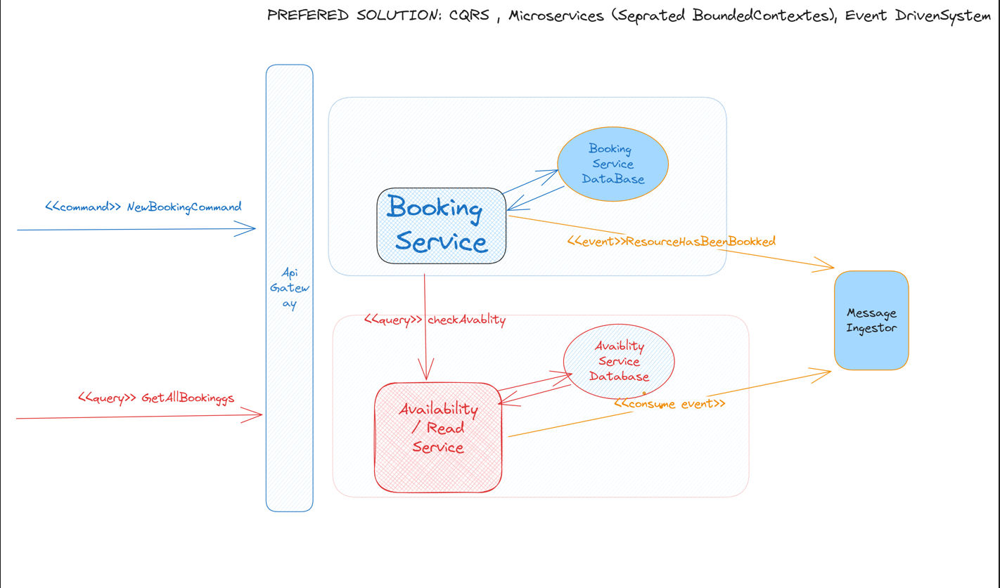

# Restaurant POC

###Implementation:
 
1. restaurantapp - Java17, SpringBoot 3, in memory event bus (from spring)  
   modules: 
     - booking (command) - creating booking
     - bookingview (query) - querings bookings
     - BookingPlacedEvent - integration event between booking and bookingview context.

2. restuarantgateway - Java17, simple gateway base on https://muserver.io/

###Big Picture Design

### How to run
1. 
git clone  git@github.com:lmaslowski/restaurant.git 

cd restaurant/restaurantapp

mvn spring-boot:run

2.
cd ../restaurantgateway

mvn compile

mvn exec:java -Dexec.mainClass=io.restaurantgateway.RestaurantGatewayApp

### Examples

#### Create New Booking
curl -d '{"bookingId":"c4cc66f3-c054-4840-a49b-949ec4a8d355","customerName":"Luke","tableSize":5,"dateTime":"2023-07-24T17:57:02"}' -H "Content-Type: application/json" -X POST http://localhost:8081/api/restaurant/booking

#### Get All Bookings
curl -X GET http://localhost:8081/api/restaurant/booking

